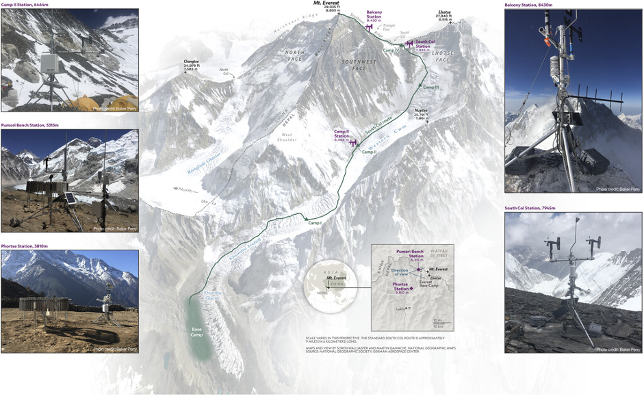

# Everest_wind_forecast
A workflow to correct wind speed global weather forecast data to the summit of Mt Everest.

Details are in the commented jupyer notebook 'full_workflow.ipynb'.

Please find the associated dataset and pre-trained machine learning model at : doi.org/10.5281/zenodo.7933287

CC-BY-NC-4.0 licence.

(Image from Matthews et al., 2020 showing the location of some of the stations used)
